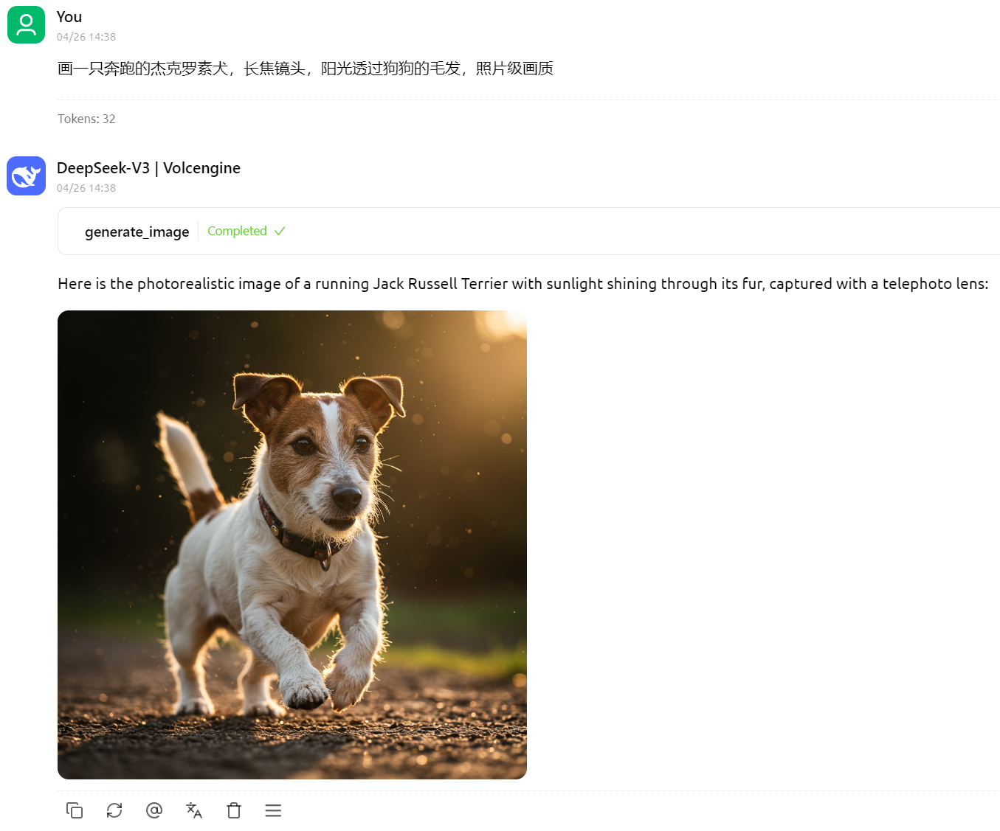
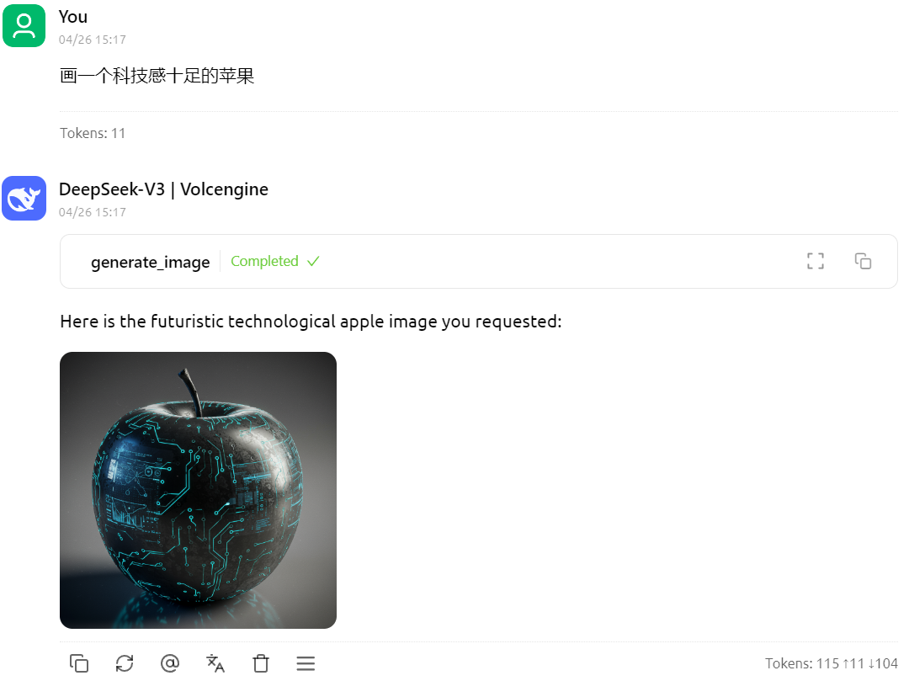
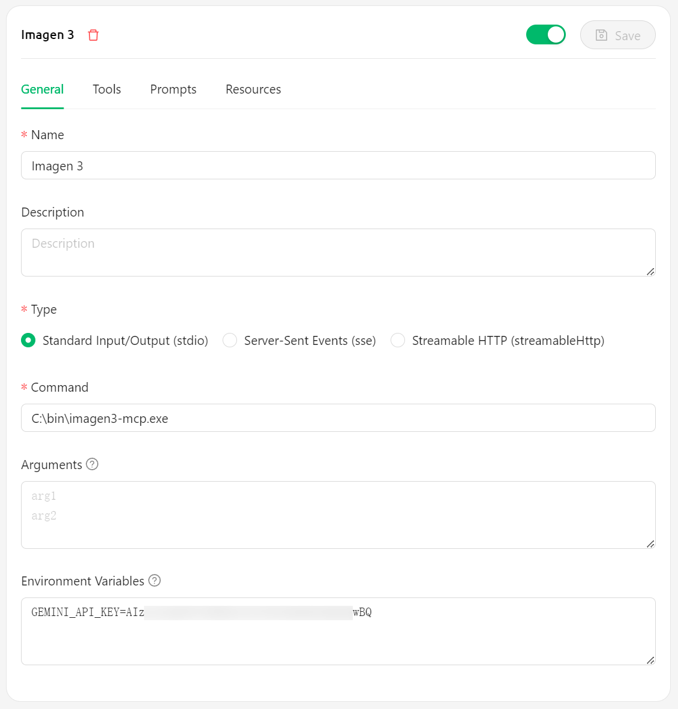

# Imagen3-MCP

[English Version](#imagen3-mcp-english)

基于 Google 的 Imagen 3.0 的图像生成工具，通过 MCP（Model Control Protocol）提供服务。

## 效果

画一只奔跑的杰克罗素犬，长焦镜头，阳光透过狗狗的毛发，照片级画质



画一个科技感十足的苹果



## 安装要求

- 有效的 [Google Gemini API 密钥](https://aistudio.google.com/apikey)

## 安装步骤——Cherry Studio

1. 从 [GitHub Releases](https://github.com/hamflx/imagen3-mcp/releases) 下载最新版本的可执行文件
2. 将下载的可执行文件放置在系统中的任意位置，例如 `C:\bin\imagen3-mcp.exe`
3. 在 Cherry Studio 中配置：
   - Command 字段填写可执行文件路径，例如 `C:\bin\imagen3-mcp.exe`
   - 环境变量 GEMINI_API_KEY 中填写你的 Gemini API 密钥



## 安装步骤——Cursor

```json
{
  "mcpServers": {
    "imagen3": {
      "command": "C:\\bin\\imagen3-mcp.exe",
      "env": {
        "GEMINI_API_KEY": "<GEMINI_API_KEY>"
      }
    }
  }
}
```

## 许可证

MIT

---

# Imagen3-MCP (English)

An image generation tool based on Google's Imagen 3.0, providing services through MCP (Model Control Protocol).

## Examples

A running Jack Russell Terrier, telephoto lens, sunlight filtering through the dog's fur, photorealistic quality


A high-tech apple


## Requirements

- Valid [Google Gemini API key](https://aistudio.google.com/apikey)

## Installation Steps—Cherry Studio

1. Download the latest executable from [GitHub Releases](https://github.com/hamflx/imagen3-mcp/releases)
2. Place the downloaded executable anywhere in your system, e.g., `C:\bin\imagen3-mcp.exe`
3. Configure in Cherry Studio:
   - Fill in the Command field with the executable path, e.g., `C:\bin\imagen3-mcp.exe`
   - Enter your Gemini API key in the GEMINI_API_KEY environment variable


## Installation Steps—Cursor

```json
{
  "mcpServers": {
    "imagen3": {
      "command": "C:\\bin\\imagen3-mcp.exe",
      "env": {
        "GEMINI_API_KEY": "<GEMINI_API_KEY>"
      }
    }
  }
}
```

## License

MIT
